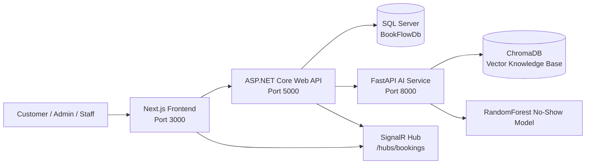

# BookFlowAI

BookFlowAI is a full-stack SaaS-style booking and AI operations platform built as a production-ready portfolio project. It combines a .NET 9 clean-architecture backend, a Python FastAPI AI microservice, and a modern Next.js frontend to deliver a real booking flow with AI no-show risk prediction, RAG-powered support, and live administrative operations.

## System architecture



## Product overview

BookFlowAI is designed for service-driven businesses such as salons, gyms, wellness centers, and clinics. The platform combines operational and customer-facing workflows into one SaaS-style experience:

- Customer booking with service, staff, and time-slot selection
- AI no-show risk scoring before confirmation
- Admin dashboard with live booking activity and operational KPIs
- Role-based access for customers, staff, and administrators
- Realtime updates through SignalR for booking status changes
- Microservice-based AI layer with ML inference and chatbot context retrieval

## Solution structure

- BookFlowAI.Api — ASP.NET Core Web API and SignalR hub
- BookFlowAI.Application — DTOs, interfaces, and service contracts
- BookFlowAI.Domain — domain entities and business rules
- BookFlowAI.Infrastructure — EF Core persistence, JWT setup, and AI gateway client
- ai_service — FastAPI service with ML and RAG logic
- frontend — Next.js app with App Router and modern TypeScript UI

## Local development prerequisites

- Docker Desktop or Docker Engine
- .NET 9 SDK
- Node.js 20+
- Optional: Gemini API key for enhanced AI response generation

## Configuration

Set environment variables as needed before running the project:

```bash
export GEMINI_API_KEY="your_key_here"
export JWT_SECRET="super-secret-key-please-change-this-now-12345"
```

## Run with Docker Compose

From the project root:

```bash
docker compose up --build
```

The stack includes:

- Frontend: http://localhost:3000
- API Swagger: 
- AI service docs: http://localhost:8000/docs
- Health endpoint: http://localhost:5000/healthz
- AI health endpoint: http://localhost:8000/healthz

## Run services individually

### 1. Backend

```bash
dotnet restore
cd BookFlowAI.Api
dotnet run
```

### 2. Frontend

```bash
cd frontend
npm install
npm run dev
```

### 3. AI microservice

```bash
cd ai_service
python -m venv .venv
source .venv/bin/activate
pip install -r requirements.txt
uvicorn main:app --host 0.0.0.0 --port 8000 --reload
```

## API summary

### Auth and account endpoints

- POST /api/auth/register
- POST /api/auth/login
- POST /api/auth/refresh-token
- POST /api/auth/revoke-token
- POST /api/auth/logout
- GET /api/account/me

### Service and staff endpoints

- GET /api/services
- GET /api/services/{id}
- GET /api/staff
- GET /api/staff/{id}/availability
- GET /api/staff/my-bookings

### Booking endpoints

- POST /api/bookings
- GET /api/bookings/my-bookings
- GET /api/bookings/{id}
- PUT /api/bookings/{id}/cancel
- PUT /api/bookings/{id}/confirm
- PUT /api/bookings/{id}/complete
- PUT /api/bookings/{id}/mark-no-show

### AI and analytics endpoints

- POST /api/ai/chat
- POST /api/ai/predict-no-show
- GET /api/analytics/summary
- GET /api/admin/dashboard/summary
- GET /api/admin/bookings/live
- PUT /api/admin/bookings/{id}/override
- GET /healthz
- GET /readyz

## Realtime signaling

SignalR hub:

- /hubs/bookings
- Events: ReceiveNewBooking, ReceiveBookingUpdate, BookingStatusUpdated

## AI and ML details

Model type: RandomForestClassifier

- Probability score range: 0.0 to 1.0
- Risk classification thresholds:
  - > = 0.60: High Risk
  - > = 0.30: Medium Risk
  - < 0.30: Low Risk
- Fallback logic is activated automatically when the AI service is unavailable or returns an unexpected response

## Deployment workflow

1. Build and start all services with Docker Compose.
2. Confirm health checks are passing for SQL Server, API, and AI service.
3. Open the frontend and authenticate through the login or register flow.
4. Use the protected customer route, admin dashboard, and service booking flow.
5. Monitor live booking updates via the SignalR hub and AI prediction responses through the API gateway.

## Security notes

- JWT access tokens are validated in ASP.NET Core middleware
- Refresh tokens are managed server-side with rotation support
- The frontend stores auth tokens in localStorage and attaches them to outgoing authenticated requests
- The frontend never calls the Python AI service directly; all AI requests are routed through the ASP.NET API gateway

## Production roadmap

- Add tenant-aware auth and extended RBAC rules
- Add advanced analytics exports and reporting
- Add OpenTelemetry tracing with structured logs and dashboards
- Add request-correlation middleware for debugging and auditing
- Harden secrets management with Azure Key Vault or equivalent secret services

## License

This project is intended for portfolio/demo purposes and can be adapted into a broader production SaaS offering.
