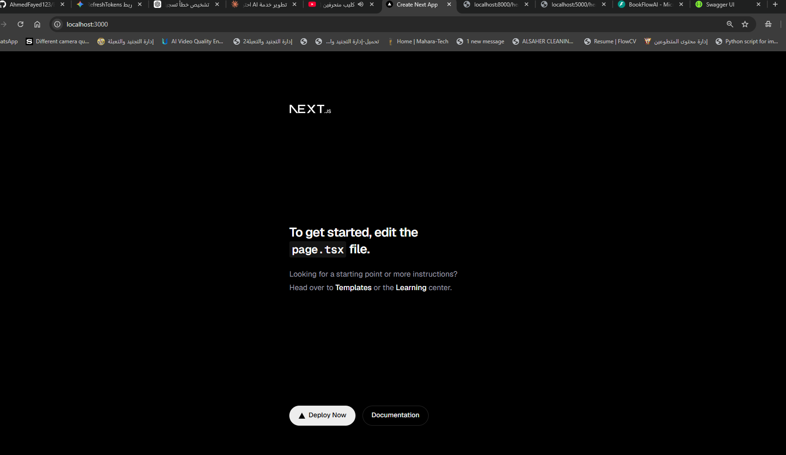
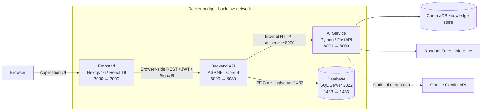

<div align="center">


<h1>BookFlow AI 🚀</h1>

<p><strong>An Enterprise-Grade Multi-Container Microservices Platform for AI-Driven Appointment Booking.</strong></p>

<p>Less scheduling friction. Smarter operations. More time for what matters.</p>


[](#license-and-author)

<p>
<a href="#quick-start">Quick Start</a> ·
<a href="#system-architecture">Architecture</a> ·
<a href="#engineering-and-resilience">Engineering</a> ·
<a href="#development-and-verification">Development</a> ·
<a href="https://github.com/AhmedFayed123/BookFlowAI/issues">Report an Issue</a>
</p>

</div>

---

## Overview

BookFlow AI brings customer bookings, provider schedules, business operations, and AI-assisted guidance into one cohesive platform. Customers discover services and reserve available slots; staff manage their schedules; administrators oversee the catalog, team, knowledge base, and business performance.

Built with enterprise-oriented engineering patterns, the repository combines a layered .NET application with independently containerized frontend, AI, and database services.

> [!IMPORTANT]
> The included Compose configuration is a **local development environment**, not a hardened production deployment. It runs the Next.js development server, enables API Swagger, and seeds demonstration accounts. Review the [production checklist](#production-checklist) before deploying publicly.

### Features

- **AI conversational booking assistant** — Gemini-powered responses enriched by a ChromaDB RAG pipeline, with helpful local fallbacks when generation or retrieval is unavailable.
- **Real-time availability & slot management** — service duration, provider schedules, time off, available slots, booking creation, cancellation, and rescheduling.
- **Dynamic reminders & notifications** — a glassmorphic notification center, unread counts, upcoming appointment reminders, booking confirmations, read/dismiss actions, and Sonner action toasts.
- **Modern glassmorphic dashboard** — responsive customer, staff, and admin workspaces with Geist typography, Lucide icons, loading skeletons, and refined feedback states.
- **Live booking operations** — SignalR updates for administrator and staff booking workflows.
- **Business intelligence** — operational analytics, booking summaries, reviews, and Random Forest no-show risk prediction.
- **Role-based accounts** — JWT authentication, refresh-token rotation, profile editing, and password management.

The assistant provides guidance; bookings are created through the authenticated booking workflow. In-app reminders refresh while BookFlow is open and are not background push, email, or SMS. Read/dismiss state is browser-local and scoped to each account.

### Product preview

| Customer experience | Admin operations | Staff workspace |
| :---: | :---: | :---: |
|  |  |  |

## System Architecture



| Service | Responsibility | Networking |
| --- | --- | --- |
| `frontend` | App Router pages, booking flows, dashboards, chat, and notifications | Browser opens port `3000`; client-side API calls use `localhost:5000/api` |
| `webapi` | Authentication, application workflows, persistence, SignalR, and AI gateway | Host port `5000` maps to container port `8080` |
| `ai_service` | RAG retrieval, Gemini responses, knowledge ingestion, and ML inference | API calls `http://ai_service:8000` through Docker DNS |
| `sqlserver` | Relational application data | API connects to `sqlserver,1433` inside the bridge network |

All four services join the custom `bookflow-network` bridge. Container-to-container calls use **service names**, not `localhost`. Public `NEXT_PUBLIC_*` URLs are consumed by the browser, which cannot resolve Docker service names.

### Health-gated startup

```text
SQL Server ── healthy ──┐
                       ├── Web API ── healthy ── Frontend
AI Service ── healthy ──┘
```

Compose uses `depends_on: condition: service_healthy` to gate API startup on SQL Server and FastAPI, then frontend startup on the API. SQL checks query the system databases; FastAPI exposes `/readyz`; the API probe uses a lightweight `wget` request to `/healthz`.

Every service has `restart: unless-stopped`. Health gating controls startup order; it is not continuous dependency recovery or a substitute for end-to-end monitoring. The current HTTP health endpoints are basic availability probes, not comprehensive dependency checks.

## Tech Stack

| Layer | Technologies |
| --- | --- |
| Frontend | Next.js 16 App Router, React 19, TypeScript, Tailwind CSS 4, Geist, Lucide React, Sonner |
| Backend API | .NET 9 Web API, Entity Framework Core 9, Clean Architecture-style layers, JWT, SignalR, Serilog |
| AI engine | Python 3.10, FastAPI, Google Gemini API, ChromaDB RAG, scikit-learn |
| Database & operations | SQL Server 2022, multi-stage Docker builds, Docker Compose, persistent volumes |

## Engineering and Resilience

- **Container stabilization following exit-code 139 failures.** The API uses matching Debian-based .NET 9 SDK/runtime images, framework-dependent publishing, and non-invariant globalization. Native-fault investigation includes application logs, image/host architecture, runtime compatibility, and OOM state; an exit code alone does not establish the root cause.
- **Explicit health probes and orchestration.** HTTP and SQL probes replace fragile shell TCP checks, with startup grace periods for database initialization and service readiness.
- **Bounded AI requests and graceful degradation.** Retrieval and Gemini calls have timeouts, empty knowledge stores skip unnecessary retrieval, and the API enforces a bounded AI HTTP request.
- **Latency transparency.** The reported local fast-path AI response figure is **~0.75 s**. No reproducible benchmark is checked in; treat this as an observation, not a production SLA or a guarantee for Gemini/RAG requests. Model downloads, cold starts, retrieval, and external generation can take longer.
- **Typed integration and recoverable UI states.** Frontend API contracts mirror backend DTOs, preserve offset-less schedule times, and provide actionable errors, loading states, and retry flows.
- **Intentional persistence.** Named volumes preserve SQL data, API data-protection keys, and frontend dependencies. AI knowledge data lives under the bind-mounted `ai_service/chroma_db` directory and requires separate backup planning.

## Quick Start

### Prerequisites

- Git.
- Docker Desktop with **Linux containers**, or Docker Engine with Docker Compose v2.
- Sufficient Docker memory and disk space for SQL Server and Python/ML dependencies. Start with at least 4 GB available; building the AI image may require more.
- An optional Gemini API key for generated responses. Without it, the assistant uses fallback guidance.

### 1. Clone the repository

```bash
git clone https://github.com/AhmedFayed123/BookFlowAI.git
cd BookFlowAI
```

### 2. Configure the environment

Create or update the root `.env` file without overwriting credentials you intend to keep:

```dotenv
# Optional: leave empty to use local AI fallback guidance.
GEMINI_API_KEY=

# Replace with a long, random secret for your environment.
JWT_SECRET=replace-with-a-long-random-development-secret
```

The Compose file currently supplies the development SQL password and connection string directly. Change **both** together if customizing the database credentials. Setting a new password does not automatically update an existing SQL data volume.

> [!WARNING]
> The root `.env` is currently tracked by Git. Keep real secrets out of tracked files; use untracked configuration overrides or a secret manager, and rotate any credentials previously published.

### 3. Build and start

```bash
docker compose build
docker compose up -d
docker compose ps
```

Or build and start in one command: `docker compose up -d --build`.

The first AI image build can be lengthy because of ML dependencies. SQL Server initialization and the first frontend compilation also take time. The API applies pending EF Core migrations and seeds development data during startup; there is no separate manual SQL setup step.

### 4. Open BookFlow

| Service | Local address | Host → container |
| --- | --- | --- |
| Frontend | [localhost:3000](http://localhost:3000) | `3000 → 3000` |
| API documentation | [localhost:5000/swagger](http://localhost:5000/swagger) | `5000 → 8080` |
| API health / readiness | [healthz](http://localhost:5000/healthz) · [readyz](http://localhost:5000/readyz) | `5000 → 8080` |
| AI documentation | [localhost:8000/docs](http://localhost:8000/docs) | `8000 → 8000` |
| AI health / readiness | [healthz](http://localhost:8000/healthz) · [readyz](http://localhost:8000/readyz) | `8000 → 8000` |
| SQL Server | `localhost,1433` — SQL client, not an HTTP URL | `1433 → 1433` |

<details>
<summary><strong>Local demonstration accounts</strong></summary>

These accounts are seeded for development only. Never expose them publicly.

| Role | Email | Password |
| --- | --- | --- |
| Admin | `admin@bookflow.com` | `Admin@123456` |
| Customer | `customer@bookflow.com` | `Customer@123` |

Sign in as a customer, choose a service, select a provider and available time, then confirm the booking request. Use the account page to change the profile or password.

</details>

## Project Structure

```text
BookFlowAI/
├── frontend/
│   ├── src/app/                  # App Router pages and layouts
│   ├── src/components/           # Booking, chat, dashboards, and shared UI
│   ├── src/lib/                  # Typed API client and notification state
│   └── tests/                    # Vitest / Testing Library tests
├── BookFlowAI.Api/               # Web API controllers, Swagger, and SignalR
├── BookFlowAI.Application/       # DTOs, interfaces, and application contracts
├── BookFlowAI.Domain/            # Domain entities
├── BookFlowAI.Infrastructure/    # EF Core, migrations, auth, and AI clients
├── ai_service/                  # FastAPI, RAG, and ML inference
├── docs/                        # API integration audit and notification guide
├── scripts/                     # Development integration verification
├── image/README/                # Product screenshots
├── BookFlowAI.sln
├── Dockerfile.api               # Multi-stage .NET API build
└── docker-compose.yml           # Four-service local environment
```

The API is located at `./BookFlowAI.Api`, **not** `./src/BookFlowAI.API`.

## Development and Verification

### Checks using the running Docker environment

```bash
docker compose config --quiet
docker compose build webapi
docker exec bookflow_frontend npm test
docker exec bookflow_frontend npx tsc --noEmit
```

Frontend tests cover booking interactions, API payload contracts, profile/password management, assistant behavior, and notification eligibility, persistence, account isolation, and recovery.

For a frontend production-build check, use Node.js 20+ on the host. Stop the development server first if it shares this working directory:

```bash
cd frontend
npm ci
npm run build
```

The [development integration script](scripts/verify-frontend-api.ps1) checks backend workflows against a loopback API. It creates isolated test records and cleans them up; **do not run it against production**.

<details>
<summary><strong>Run application code on the host</strong></summary>

Requires Node.js 20+, the .NET 9 SDK, and the relevant infrastructure services.

```bash
docker compose up -d sqlserver ai_service
dotnet build BookFlowAI.sln
```

For the API on a Bash shell:

```bash
AiService__BaseUrl=http://localhost:8000 dotnet run --project BookFlowAI.Api
```

For PowerShell:

```powershell
$env:AiService__BaseUrl = "http://localhost:8000"
dotnet run --project BookFlowAI.Api
```

The default host API profile listens on `http://localhost:5185`. Set the frontend URLs to that port when using the host API.

For the frontend, create `frontend/.env.local`:

```dotenv
NEXT_PUBLIC_API_URL=http://localhost:5000/api
NEXT_PUBLIC_SIGNALR_URL=http://localhost:5000/hubs/bookings
NEXT_PUBLIC_AI_API_URL=http://localhost:5000/api
```

```bash
cd frontend
npm install
npm run dev
```

These settings route browser AI requests through the .NET gateway, matching Compose. Without an AI URL override, the compatibility AI client defaults to FastAPI on port `8000`.

</details>

### API references

- [API integration audit](docs/frontend-api-audit.md) — endpoint coverage and frontend mappings.
- [Notification implementation guide](docs/frontend-notifications.md) — data sources, state, mock fixtures, and limitations.
- [Local Swagger UI](http://localhost:5000/swagger) — authentication, bookings, catalog, staff, administration, analytics, reviews, and AI gateway endpoints.
- SignalR hub: `/hubs/bookings`.
- Public AI gateway: `/api/ai/chat` and `/api/ai/chat/predict-no-show`.

## Troubleshooting and Operations

```bash
# Inspect service status and startup errors.
docker compose ps -a
docker compose logs --tail=200 sqlserver webapi ai_service frontend

# Follow application logs.
docker compose logs -f webapi frontend ai_service

# Rebuild only the API.
docker compose up -d --build webapi

# Refresh the frontend after bind-mounted file changes.
docker compose restart frontend

# Stop the stack without deleting named volumes.
docker compose down
```

| Symptom | What to check |
| --- | --- |
| SQL Server is unhealthy | SQL logs, password configuration, initialization time, memory, and the `sqlcmd` health probe |
| API exits, including code 139 | Managed/native logs, runtime/image architecture, database initialization, stale images, and OOM status |
| Frontend waits or shows an old build | API health, npm installation, the dependency volume, container restart, and browser hard refresh |
| AI response fails or is slow | Gemini key/model availability, knowledge ingestion, external connectivity, and AI service logs |
| Port is already allocated | Existing containers/processes on `3000`, `5000`, `8000`, or `1433` |

For API crash diagnostics:

```bash
docker inspect bookflow_api --format '{{.State.ExitCode}} {{.State.OOMKilled}} {{.State.Error}}'
```

<details>
<summary><strong>Clean rebuild — destructive to local database data</strong></summary>

> [!CAUTION]
> `docker compose down -v` deletes Compose-managed named volumes, including the SQL database, frontend dependencies, and API data-protection keys. Back up anything valuable first. AI data in the host bind mount is not removed by this command.

```bash
docker compose down -v --remove-orphans
docker compose build --no-cache
docker compose up -d
docker compose ps
```

</details>

## Production Checklist

Before making this stack internet-facing:

- [ ] Replace development secrets, SQL credentials, and seeded accounts; remove real secrets from tracked files and rotate exposed keys.
- [ ] Build immutable frontend/AI images; remove development bind mounts and use `next start` rather than `next dev`.
- [ ] Configure HTTPS, secure token handling, environment-specific URLs, restrictive CORS, and Swagger access.
- [ ] Run database migrations as a controlled deployment step rather than on every application startup.
- [ ] Back up SQL Server, ChromaDB knowledge data, and data-protection keys; test restoration.
- [ ] Add dependency-aware readiness checks, rate limiting, centralized logs, tracing, and operational alerting.
- [ ] Audit and update application/runtime dependencies, including development test tooling.
- [ ] Add CI gates for builds, tests, migration drift, dependency audits, and container scanning.
- [ ] Verify capacity, image architecture support, and SQL Server edition/licensing suitability for the target environment.
- [ ] Add a reproducible AI latency benchmark before publishing service-level performance guarantees.

## Contributing

Focused improvements, bug reports, and documentation contributions are welcome.

1. Open an [issue](https://github.com/AhmedFayed123/BookFlowAI/issues) describing the problem or proposal.
2. Create a branch with a scoped change.
3. Add relevant tests and run the verification commands.
4. Submit a pull request with a clear description and screenshots for visual changes.

Never include credentials, production data, or personal customer information in issues or pull requests.

## License and Author

**License: MIT — project designation.** A standalone `LICENSE` file is not currently present in this checkout. Add the complete MIT license text and copyright notice before distributing the project under that license.

Created by **Ahmed Fayed**.

[GitHub](https://github.com/AhmedFayed123) · [LinkedIn](https://www.linkedin.com/in/ahmed-hesham-33572b245/) · [Repository](https://github.com/AhmedFayed123/BookFlowAI)

The LinkedIn address is listed on the author's [GitHub profile](https://github.com/AhmedFayed123).

---

<div align="center">
<sub>BookFlow AI · Thoughtful booking. Practical engineering.</sub>
</div>
