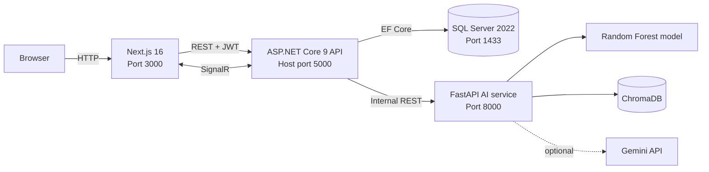

# BookFlowAI

BookFlowAI is a full-stack booking platform for appointment-driven businesses. It combines an ASP.NET Core API, a Next.js frontend, SQL Server, and a Python AI service for no-show prediction and retrieval-augmented chat.

> This repository is a portfolio and development project. The default credentials and secrets are intended for local use only and must be replaced before deployment.

## What it includes

- Customer registration, authentication, and booking management
- Configurable business categories, services, staff, and schedules
- Staff availability, time-off, and booking workflows
- Admin dashboards, booking overrides, analytics, and knowledge management
- JWT access tokens and server-side refresh-token rotation
- Live booking updates over SignalR
- Random Forest no-show risk prediction
- ChromaDB-backed knowledge retrieval with optional Gemini responses
- Docker Compose health checks, dependency ordering, and persistent volumes

## Screenshots

| Customer experience | Admin operations | Staff workspace |
| --- | --- | --- |
|  |  |  |

## Architecture



The browser communicates with the ASP.NET Core API. The API owns authentication, application workflows, persistence, and the public AI endpoints; the Python service is an internal inference and retrieval component.

## Technology stack

| Area | Technology |
| --- | --- |
| Frontend | Next.js 16, React 19, TypeScript, Tailwind CSS, TanStack Query |
| Backend | .NET 9, ASP.NET Core, EF Core 9, SignalR, Serilog |
| AI service | Python 3.10, FastAPI, scikit-learn, ChromaDB, Gemini |
| Database | SQL Server 2022 |
| Runtime | Docker Compose |

## Repository layout

```text
BookFlowAI.Api/             HTTP API, authentication pipeline, controllers, SignalR hub
BookFlowAI.Application/     DTOs, interfaces, and application contracts
BookFlowAI.Domain/          Domain entities
BookFlowAI.Infrastructure/  EF Core, migrations, authentication, and service clients
ai_service/                 FastAPI, ML inference, and RAG implementation
frontend/                   Next.js application and frontend tests
Dockerfile.api              Multi-stage .NET API image
docker-compose.yml          Local multi-container environment
```

## Run the complete stack

### Prerequisites

- Docker Desktop or Docker Engine with Compose v2
- At least 4 GB of memory available to Docker; SQL Server is the largest consumer
- A Gemini API key only if generated AI responses are required

### 1. Configure local environment variables

Create or update `.env` in the repository root:

```dotenv
GEMINI_API_KEY=your-gemini-api-key
JWT_SECRET=replace-with-a-long-random-development-secret
```

The AI service can still start without a Gemini key, but generative responses may use its fallback behavior.

### 2. Build and start

```bash
docker compose up -d --build
docker compose ps
```

Compose starts services in this order:

```text
SQL Server ─┐
            ├─ healthy ─> Web API ─ healthy ─> Frontend
AI service ─┘
```

First startup can take several minutes while SQL Server initializes and npm populates the frontend dependency volume.

### 3. Open the applications

| Service | URL |
| --- | --- |
| Frontend | <http://localhost:3000> |
| API Swagger UI | <http://localhost:5000/swagger> |
| API health | <http://localhost:5000/healthz> |
| API readiness | <http://localhost:5000/readyz> |
| AI Swagger UI | <http://localhost:8000/docs> |
| AI health | <http://localhost:8000/healthz> |
| SQL Server | `localhost,1433` |

### Development accounts

The startup seeder creates these local-only accounts:

| Role | Email | Password |
| --- | --- | --- |
| Admin | `admin@bookflow.com` | `Admin@123456` |
| Customer | `customer@bookflow.com` | `Customer@123` |

## Common Docker commands

```bash
# Follow logs from the application-facing services
docker compose logs -f webapi frontend ai_service

# Rebuild only the API
docker compose up -d --build webapi

# Stop containers while preserving named volumes
docker compose down

# Show container and health status
docker compose ps -a
```

### Completely clean rebuild

Use this when migrations or cached frontend dependencies are out of sync:

```bash
docker compose down -v --remove-orphans
docker compose build --no-cache
docker compose up -d
docker compose ps
docker compose logs -f webapi frontend
```

> **Data-loss warning:** `docker compose down -v` deletes every Compose-managed named volume, including the SQL Server database, frontend dependencies, and ASP.NET Core data-protection keys.

## Run services locally

Docker Compose is the simplest supported workflow. For faster application development, start infrastructure in Docker and run the API or frontend on the host.

### ASP.NET Core API

Requires the .NET 9 SDK and SQL Server on `localhost:1433`.

```bash
docker compose up -d sqlserver ai_service
dotnet restore
```

When the API runs on the host, set `AiService__BaseUrl=http://localhost:8000` so AI requests do not use Docker's internal `ai_service` hostname. In PowerShell:

```powershell
$env:AiService__BaseUrl = "http://localhost:8000"
dotnet run --project BookFlowAI.Api
```

In Bash:

```bash
AiService__BaseUrl=http://localhost:8000 dotnet run --project BookFlowAI.Api
```

The default local API URL is <http://localhost:5185>; Swagger is available at <http://localhost:5185/swagger> in Development.

### Next.js frontend

Requires Node.js 20 or newer.

```bash
cd frontend
npm install
npm run dev
```

For the same API-gateway routing used by Compose, create `frontend/.env.local`:

```dotenv
NEXT_PUBLIC_API_URL=http://localhost:5000/api
NEXT_PUBLIC_SIGNALR_URL=http://localhost:5000/hubs/bookings
NEXT_PUBLIC_AI_API_URL=http://localhost:5000/api
```

Without overrides, REST and SignalR use the API on port `5000`, while the frontend AI client uses the FastAPI service on port `8000` directly.

### FastAPI AI service

Requires Python 3.10. On Windows PowerShell, activate the environment with `.venv\Scripts\Activate.ps1`; on Linux or macOS, use `source .venv/bin/activate`.

```bash
cd ai_service
python -m venv .venv
python -m pip install -r requirements.txt
uvicorn main:app --host 0.0.0.0 --port 8000 --reload
```

## API overview

Swagger is the authoritative interactive API reference. The main route groups are:

| Area | Routes |
| --- | --- |
| Authentication | `/api/auth/*`, `/api/account/*` |
| Bookings | `/api/bookings/*` |
| Catalog | `/api/business-categories/*`, `/api/services/*` |
| Staff | `/api/staff/*`, `/api/admin/staff/*` |
| Administration | `/api/admin/*` |
| Analytics | `/api/analytics/*` |
| Reviews | `/api/reviews/*` |
| AI gateway | `/api/ai/chat`, `/api/ai/chat/predict-no-show` |
| SignalR | `/hubs/bookings` |

The internal FastAPI service exposes `/predict-no-show`, `/chat`, and `/ingest-business-data`. Browser clients should use the ASP.NET Core gateway rather than calling these internal routes directly.

## Database migrations

The API applies pending EF Core migrations and seeds development data during startup. Create schema changes from the repository root:

```bash
dotnet ef migrations add YourMigrationName \
  --project BookFlowAI.Infrastructure/BookFlowAI.Infrastructure.csproj \
  --startup-project BookFlowAI.Api/BookFlowAI.Api.csproj \
  --output-dir Persistence/Migrations
```

Check for model drift before committing:

```bash
dotnet ef migrations has-pending-model-changes \
  --project BookFlowAI.Infrastructure/BookFlowAI.Infrastructure.csproj \
  --startup-project BookFlowAI.Api/BookFlowAI.Api.csproj
```

## Tests and build checks

```bash
# Backend compilation
dotnet build BookFlowAI.sln

# Frontend unit tests
cd frontend
npm test

# Frontend production build
npm run build
```

## Troubleshooting

### API exits or reports exit code 139

Exit codes alone can be misleading. Inspect the managed application logs first:

```bash
docker compose logs --tail=200 webapi
docker inspect bookflow_api --format '{{.State.ExitCode}} {{.State.OOMKilled}} {{.State.Error}}'
```

Common causes in this project are pending EF Core model changes, an unavailable SQL database, or stale images. Confirm that EF reports no pending changes, then perform a clean rebuild if disposable local data can be removed.

### Frontend remains in `npm install`

The Compose setup stores `/app/node_modules` in a named volume. If that cache was created from an older manifest, use the completely clean rebuild sequence above. Remember that `down -v` also removes SQL data.

### A port is already allocated

Find and stop the process or container using ports `3000`, `5000`, `8000`, or `1433`, or change the published port on the left side of the relevant Compose mapping.

### Check individual health probes

```bash
curl http://localhost:5000/healthz
curl http://localhost:8000/readyz
docker compose ps
```

## Production considerations

Before deploying outside a local development environment:

- Move SQL, JWT, and Gemini secrets to a secret manager
- Replace the default SQL administrator password and seeded user credentials
- Run migrations as a controlled deployment step
- Configure HTTPS, restrictive CORS origins, and secure token storage
- Persist and back up SQL Server and ChromaDB data intentionally
- Add rate limiting, request correlation, distributed tracing, and centralized logs
- Build immutable frontend and AI images instead of using development bind mounts
- Add CI checks for backend builds, frontend tests, migrations, and container images

## Contributing

Create a focused branch, include tests where practical, and verify `dotnet build`, `npm test`, and `docker compose config` before opening a pull request.
